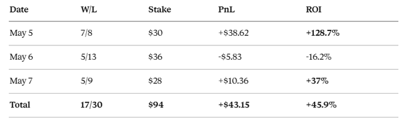

link: https://x.com/theparuchh/status/2052406323388490199

Skipped ACT 1...
ACT 2, ONE COORDINATE
I opened the rules of one of my losing markets, Atlanta, May 2
Read it carefully:
"This market will resolve to the temperature range that contains the highest temperature recorded at the Hartsfield-Jackson International Airport Station in degrees Fahrenheit on 2 May."
Hartsfield-Jackson Airport Station
Not "Atlanta", not "city center", a specific weather station at a specific airport.
And I was pulling forecasts for downtown Atlanta. On Google Maps that's 13 kilometers from the airport.
I went to check the rest of my cities. Here's what I found:
> NYC → LaGuardia (KLGA, queens by the bay), I was pulling Manhattan
> Atlanta → Hartsfield (KATL), got lucky, center is close
> Miami → Miami Intl (KMIA), got lucky
> Chicago → O'Hare (KORD, far western airport), I was pulling downtown
> Dallas → Love Field (KDAL), got lucky

> Tokyo → Haneda (RJTT, southern Tokyo, by the bay), I was pulling Narita (60km!)
> Seoul → Incheon (RKSI, by the sea, 50km west), I was pulling downtown Seoul
> Hong Kong → Hong Kong Observatory (NOT airport), I was pulling Lantau (30km)
> Singapore → Changi (WSSS), got lucky

> London → London City (EGLC), got lucky
> Paris → Le Bourget (LFPB, northern suburbs), I was pulling Charles de Gaulle

Out of my 11 cities, 5 had wrong coordinates
Every single day, for a month straight, I was pulling forecasts for places that don't resolve
Hong Kong center to Lantau, 2 to 3°C cooler. Sea, wind, island
Tokyo center vs Narita, 1 to 2°C difference. Airport sits in fields, no urban heat island effect
Seoul center vs Incheon, 1.5°C cooler. Sea proximity
Those 1 to 3°C misses, that was exactly why I kept missing the bin every single day
The models weren't lying. I was pulling forecasts for the wrong places

ACT 3, WHAT ELSE I FOUND
After the coordinates discovery I dug deeper into the Open-Meteo API. Read through the docs. Found a parameter most bots don't know about:
"bias_correction": "true"
What it does, the API applies a local correction for a specific weather station. Accounts for urban heat island, coastal effects, elevation, surface type. Without this parameter the API gives you a "general" forecast for the region. With it, you get a forecast for a specific point
Accuracy improves by 30 to 40%. It's free, you just add it to the URL
Then I figured out the entry window
In the first version I was placing bets 6 to 12 hours before resolution. Thought, the closer the more accurate the models. That was wrong
> 6 to 12 hours before resolution
> YES prices already at 50¢+
> market has already priced in the latest forecasts
> edge is squeezed

> 18 to 30 hours before resolution
> prices are 10 to 30¢ on the same bins
> market hasn't reacted to the fresh models yet
> sweet spot
I switched to the 18 to 30 hour window. That rewrote half of my bets.
Third finding, models need to be used together
Before I was running just GFS ensemble. Good but only one. Now:
ICON (DWD, Germany)
GFS (NOAA, USA)
ECMWF (Europe)
If 2 models agree (within 1°C of each other), the third is treated as an outlier. If all three diverge by more than 3°C, we skip the market entirely. The models don't know what's coming, so we don't either
And the last one, 3 bins instead of one
In the first version I bet on the single best bin. If I hit, win. If I missed by 1°C, full loss
The new version covers 3 adjacent bins at the same time. Center of consensus, plus one on each side (or two above if the outlier is up there). One of them almost always lands
Stake size grew from $2 to $6 per event. But the win rate jumped from 18% to 30%
> sum of 3 bin prices ≤ 95¢, math edge guaranteed
> each bin ≥ 1¢, skip resolved markets
> each bin ≤ 45¢, skip overpriced markets
If any of these three conditions fails, the event gets skipped. Better not to trade than to trade with bad math
ACT 4, THE GUIDE WITH CODE
Steps 1 through 7 from my first article are still current. Mac setup, Homebrew install, Python, Claude Code, wallet, Polymarket deposit. If this is your first time, run through them in that article first, [https://x.com/theparuchh/status/2044089761699102827]

What follows is the updated part, how I rewrote the bot after 3 weeks of mistakes

Step 8, Project setup
Paste this into Claude Code:
Create a Python project for a Polymarket weather trading bot.
Initialize virtual environment with python3.11.
Install: requests, websockets, web3, scipy, numpy, schedule, python-dotenv
Plus py-clob-client from Polymarket github

Create .env.example with:
POLYMARKET_PRIVATE_KEY, POLYMARKET_SAFE_ADDRESS
Create a Python project for a Polymarket weather trading bot.
Initialize virtual environment with python3.11.
Install: requests, websockets, web3, scipy, numpy, schedule, python-dotenv
Plus py-clob-client from Polymarket github

Create .env.example with:
POLYMARKET_PRIVATE_KEY, POLYMARKET_SAFE_ADDRESS
Say Yes to every permission request

Step 9, Coordinates (CRITICAL)
This is the most important part. Coordinates must point to the resolution station on Polymarket, not the city center
# config.py

CITIES = {
    # US, resolves in °F
    "NYC":       {"lat": 40.7772, "lon": -73.8726, "station": "KLGA"},  # LaGuardia
    "Atlanta":   {"lat": 33.6407, "lon": -84.4277, "station": "KATL"},  # Hartsfield
    "Miami":     {"lat": 25.7959, "lon": -80.2870, "station": "KMIA"},  # Miami Intl
    "Chicago":   {"lat": 41.9742, "lon": -87.9073, "station": "KORD"},  # O'Hare
    "Dallas":    {"lat": 32.8471, "lon": -96.8518, "station": "KDAL"},  # Love Field
    
    # Asia, resolves in °C
    "Tokyo":     {"lat": 35.5494, "lon": 139.7798, "station": "RJTT"},  # Haneda NOT Narita
    "HongKong":  {"lat": 22.3022, "lon": 114.1742, "station": "HKO"},   # Observatory NOT airport
    "Singapore": {"lat": 1.3502,  "lon": 103.9940, "station": "WSSS"},  # Changi
    "Seoul":     {"lat": 37.4691, "lon": 126.4505, "station": "RKSI"},  # Incheon
    
    # Europe, resolves in °C
    "London":    {"lat": 51.5048, "lon": 0.0495,   "station": "EGLC"},  # London City
    "Paris":     {"lat": 48.9694, "lon": 2.4414,   "station": "LFPB"},  # Le Bourget NOT CDG
}
Verify each city yourself. Open the market on Polymarket, read the Rules section, find the phrase "recorded at the [NAME] Station". Don't trust my list blindly, Polymarket may change the station for new markets

Step 10, Forecast with three models
# forecast_consensus.py

import requests
from datetime import date, timedelta

def fetch_forecast(lat, lon, target_date):
    url = "https://api.open-meteo.com/v1/forecast"
    params = {
        "latitude": lat,
        "longitude": lon,
        "models": "icon_seamless,gfs_seamless,ecmwf_ifs025",
        "hourly": "temperature_2m",
        "bias_correction": "true",
        "temperature_unit": "celsius",
        "start_date": target_date.isoformat(),
        "end_date": target_date.isoformat(),
    }
    
    r = requests.get(url, params=params, timeout=30)
    data = r.json()
    
    icon_max  = max(data["hourly"]["temperature_2m_icon_seamless"])
    gfs_max   = max(data["hourly"]["temperature_2m_gfs_seamless"])
    ecmwf_max = max(data["hourly"]["temperature_2m_ecmwf_ifs025"])
    
    spread = max(icon_max, gfs_max, ecmwf_max) - min(icon_max, gfs_max, ecmwf_max)
    agree = spread <= 3.0
    
    return {
        "icon": icon_max,
        "gfs": gfs_max,
        "ecmwf": ecmwf_max,
        "spread": spread,
        "agree": agree
    }
The bias_correction=true parameter is what 90% of bots don't know about. It enables local correction for the station.
Step 11, Entry window 18 to 30 hours
WIN_MIN_H = 18.0
WIN_MAX_H = 30.0

def in_window(target_date_utc, now_utc):
    resolve_time = target_date_utc + timedelta(hours=24)  # resolves at end of day
    hours_until = (resolve_time - now_utc).total_seconds() / 3600
    return WIN_MIN_H <= hours_until <= WIN_MAX_H

    Don't bet earlier than 30 hours, the models are too inaccurate. Don't bet later than 18 hours, the market has already priced in the fresh data

Step 12, 3-bin strategy
# portfolio_builder.py

def build_portfolio(forecast, bin_prices):
    if not forecast["agree"]:
        return None  # SKIP, models disagree
    
    # Find the closest pair of models
    icon, gfs, ecmwf = forecast["icon"], forecast["gfs"], forecast["ecmwf"]
    distances = {
        ("icon", "gfs"):   abs(icon - gfs),
        ("icon", "ecmwf"): abs(icon - ecmwf),
        ("gfs", "ecmwf"):  abs(gfs - ecmwf),
    }
    closest = min(distances, key=distances.get)
    
    if distances[closest] <= 1.0:
        # Tight pair exists
        pair_values = [forecast[m] for m in closest]
        center = sum(pair_values) / 2
        outlier = next(forecast[m] for m in ["icon", "gfs", "ecmwf"] if m not in closest)
    else:
        # All three are spread out
        center = (icon + gfs + ecmwf) / 3
        outlier = None
    
    center_bin = find_bin_for_temp(bin_prices, center)
    if center_bin is None:
        return None
    
    above_1 = adjacent_bin(bin_prices, center_bin, "above")
    above_2 = adjacent_bin(bin_prices, above_1, "above") if above_1 else None
    below_1 = adjacent_bin(bin_prices, center_bin, "below")
    
    # CASE A, outlier above center, bet upward
    # CASE B/C, outlier below or no outlier, center plus above plus below
    if outlier and outlier > center:
        plan = [center_bin, above_1, above_2]
    else:
        plan = [center_bin, above_1, below_1]
    
    plan = [b for b in plan if b is not None]
    
    if len(plan) < 2:
        return None
    
    return plan
Step 13, Price filters
def passes_filters(plan):
    prices = [b["yes_price"] for b in plan]
    
    if sum(prices) > 0.95:
        return False  # no math edge
    if any(p < 0.01 for p in prices):
        return False  # resolved bin
    if any(p > 0.45 for p in prices):
        return False  # market already priced in, overpaying
    
    return True
If any condition fails, the event gets skipped. Better skip than a bad bet.
Step 14, Launch
After all the files are in place:
The bot will scan markets in the 18 to 30 hour window every 10 minutes, calculate forecasts, check prices, and add qualifying bets to paper_trades.csv.
When you see 30+ closed bets and a positive ROI, switch to live mode. Steps 14 through 22 for live trading are the same as in the first article
ACT 5, MISTAKES AND SCARS
Not everything in this version is fixed. A few scars are still on the bot today

Scar 1, Coordinates inside coordinates
I thought station="RJTT" in the code meant correct Haneda coordinates. Turns out I had the ICAO code for Haneda but the coordinates of Narita (35.7647, 140.3864). The bot was pulling forecasts for Narita under the name Haneda for 14 days.
How to verify yourself, open Google Maps, type in the coordinates, look at what's actually there.
Scar 2, Bin gaps
In Fahrenheit there are bins 56-57°F and 58-59°F. Between them is a gap, no 57-58°F bin. A forecast of 14.0°C (~57.2°F) falls into the hole. The bot misses every bin.
Fix in the code, fallback to nearest bin midpoint. If the forecast center falls into a gap, take the bin closest to that center.
Scar 3, Hong Kong doesn't work
Even with correct Observatory coordinates, Hong Kong keeps losing. May 7, 3 bets on HK, all three lost.
Looks like a seasonal issue, May in subtropical climates means rapid warming, and the models systematically run cold. I'm thinking about adding +1°C bias for Hong Kong, shift the forecast center upward. Haven't implemented it yet, need more data.
If you run into the same situation, try adding bias correction for cities that systematically lose:
CITY_BIAS_C = {
    "HongKong": +1.0,  # models run cold by 1°C in summer
}
Be careful though, this can break other seasons.
Scar 4, Paid ensembles
Open-Meteo is free and good. But there are paid alternatives that might give a bigger edge:
Visual Crossing, $35 per month, METAR plus station data, very accurate for US
Tomorrow.io, $50 per month, hyper-local, premium ECMWF ensemble
Atmospheric Data Service (ECMWF), $50 to 200 per month, 51 different runs of ECMWF ensemble (instead of just one)
If free models give you +20% ROI on a $130 bank, $50 per month won't pay off. But if you have a $1000+ bank and a stable plus, paid ensembles can add another 5 to 10% ROI. Pays back in 2 to 3 months.
I'm still on free models. But if v3 confirms positive over a month, the next step is ECMWF ensemble
ACT 6, RESULTS
The first 3 days of the v3 final version:

47 bets, 36% win rate, +45.9% ROI over 3 days
Without Tokyo (still not fully fixed), the numbers are even better
It's not +100% every day. May 6 the bot missed almost everywhere, Hong Kong and Tokyo systematically gave a minus. But the cheap bins that do hit (Miami 88°F at 12¢, Hong Kong 23°C at 10¢) deliver huge multipliers and compensate for 5 to 6 losing $2 bets
The strategy works not because the bot always guesses right. The strategy works because when it hits, the payout is $14 to $20. When it misses, it loses $2
3 versions before this one lost $63. This version made $43 in 3 days. That's the difference between "the bot doesn't work" and "the bot works"
I'll keep improving it
Hong Kong needs a fix. Tokyo on the correct coordinates hasn't been fully tested. The entry window might need to shift to 24 to 36 hours. Lottery scanner on 0.1¢ bins is still on the to-do list
In a week I'll publish new numbers. In a month, a full report on what worked and what didn't